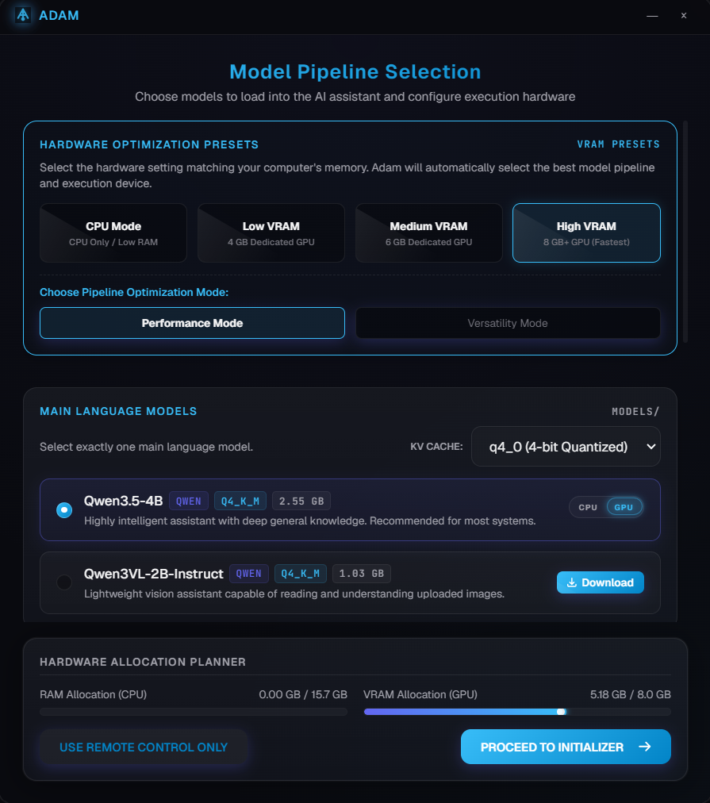
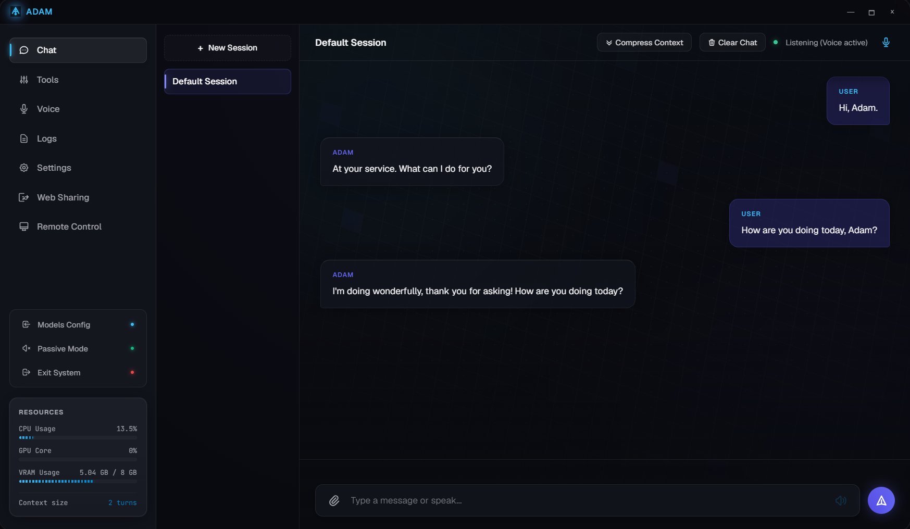
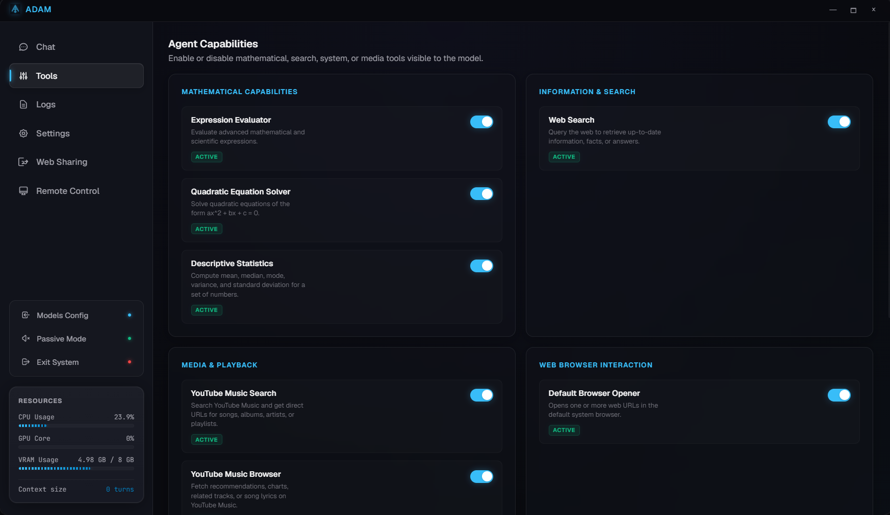
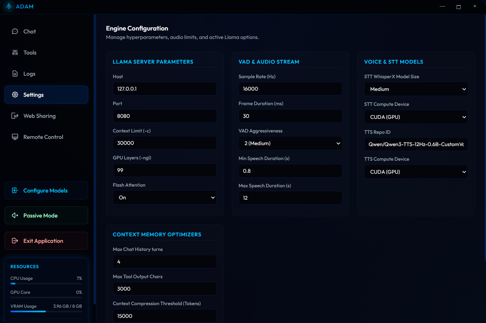
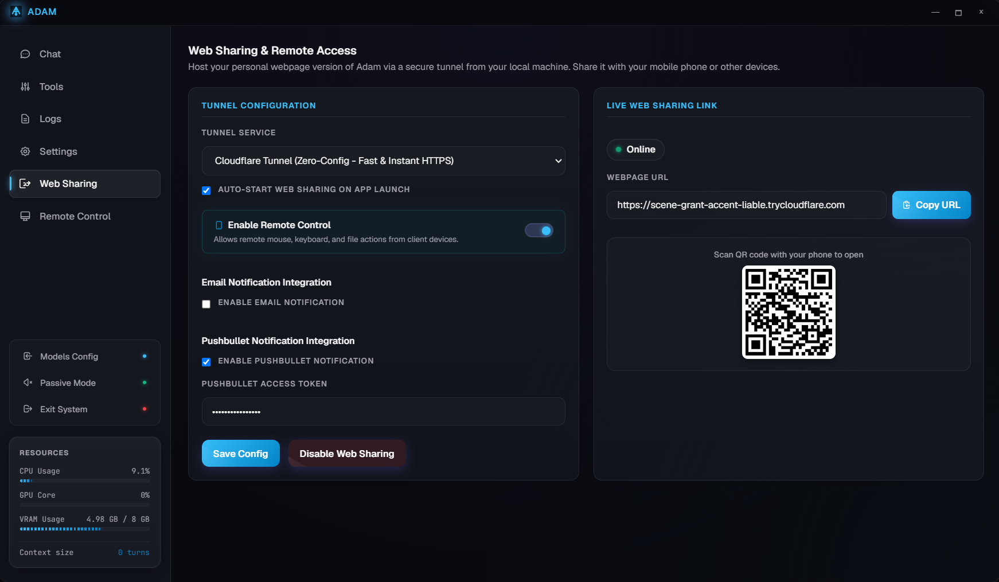
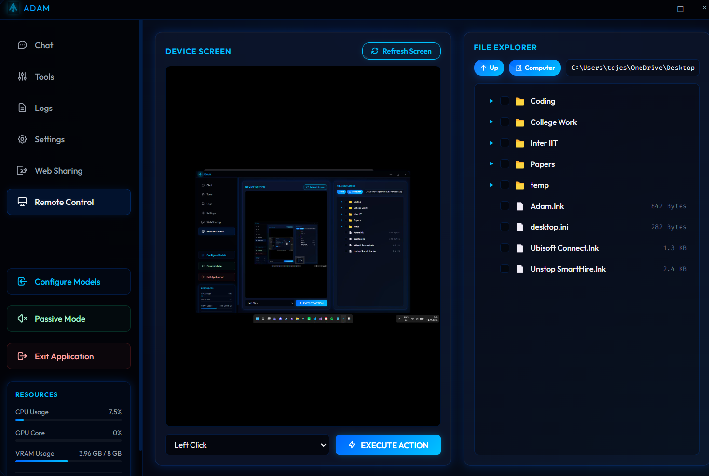

# Adam: Local AI Desktop Assistant

Adam is a fast, completely local desktop application that lets you run and chat with AI models on your own computer. It combines text chat, real-time voice recognition (Speech-to-Text), and natural voice synthesis (Text-to-Speech) into a single interface. 

You can use it as a voice assistant, a standard chat interface, or even let the AI perform background tasks, take screenshots, browse local files, and control your mouse and keyboard. Because everything runs locally, your data never leaves your machine.

---

## Table of Contents

* [How It's Structured](#how-its-structured)
* [Core Features](#core-features)
* [Technical Specifications](#technical-specifications)
* [Installation & Setup Guide](#installation--setup-guide)
* [Building a Standalone Installer](#building-a-standalone-installer)

---

## How It's Structured

Adam separates the frontend interface from the backend server. This keeps the user interface incredibly smooth and responsive, even when the AI models are using full system resources to generate answers or process audio.

```
               +-------------------------------------------------------+
               |                   ELECTRON CLIENT                     |
               |  - HTML5/JS Interface & Neon-Cyan Styling             |
               |  - Main Process Control Daemon                        |
               |  - Server-Sent Events (SSE) Listener                  |
               |  - IPC Main/Renderer Bridge                           |
               +--------------------------+----------------------------+
                                          |
                                HTTP / SSE Requests
                                          |
               +--------------------------v----------------------------+
               |                   FASTAPI BACKEND                     |
               |  - Uvicorn Server (http://127.0.0.1:8000)             |
               |  - Handles conversation flow & app state              |
               |  - Monitors system resources & running processes      |
               |  - Cleans up temporary disk files & cache             |
               +----+---------------------+-----------------------+----+
                    |                     |                       |
               +----v----+           +----v----+             +----v----+
               |  LLaMA  |           | Whisper |             |  Qwen   |
               | SERVER  |           |   STT   |             |   TTS   |
               +---------+           +---------+             +---------+
```

### Subsystem Breakdown

* **Frontend Client (`electron/`)**
  The desktop wrapper built with Electron. It handles navigating between screens (like model selection, initial setup, and the main chat workspace), saves your local hardware configurations, and runs scripts to securely tunnel your connection for remote access.

* **FastAPI Server (`backend/src/api_server.py`)**
  The backbone of the application. Running on a Uvicorn server, it manages the active chat sessions, updates the front-end with system diagnostics, and coordinates the audio queue so that generated speech plays back naturally.

* **LLaMA Server Daemon**
  Automatically launches a background `llama-server.exe` instance. It handles running GGUF language models and is set up to automatically use graphics acceleration (NVIDIA CUDA) if you have a compatible graphics card.

* **Speech-to-Text (`WhisperX`)**
  Listens to your microphone and instantly transcribes what you say into text.

* **Text-to-Speech (`Qwen-TTS`)**
  Takes the text written by the AI and reads it back to you in real-time with a custom, natural voice.

---

## Core Features

### 1. Hardware Detection & Smart Downloader

> **No more guesswork.** The app automatically detects what your PC can handle and helps you download the models in a few clicks.

* **Hardware Optimization**: On startup, the app scans your CPU, system RAM, GPU model, and VRAM. It then calculates and recommends the best model settings so you get fast generation speeds without running out of memory.
* **Concurrent Downloads**: You can search and download models directly from Hugging Face inside the app. It supports downloading multiple files at the same time, complete with individual progress bars, speed trackers, and status logs.
* **No Admin Rights Needed**: It bypasses Windows symbolic link limits by writing files directly to snapshot paths, meaning you do not need to launch the app as an administrator to download or configure models.



---

### 2. Live Chat Optimizations

> **Fluid conversation.** Text streams in real-time, and web searches are limited to keep responses lightning-fast.

* **Token Streaming**: Text appears word-by-word as it is being generated. This includes the final answers written after using tools, ensuring you never have to wait for a massive block of text to load all at once.
* **Smart Web Searches**: The AI can browse the web using Brave Search (with DuckDuckGo Search as a fallback) to answer questions about recent events. To prevent the model from getting stuck in an endless loop of searching, it is limited to a maximum of 2 searches per turn.
* **Clean UI**: Messy internal thoughts (like `<think>` tags used by reasoning models) and system terminal logs are hidden from the main window so you can focus on the chat.



---

### 3. Background Tool Action Logging

> **Total transparency.** Keep track of everything the AI does behind the scenes.

* **Interactive Toolbelt**: The AI has access to several local tools. It can run complex math equations, open URLs in your default browser, or execute system commands.
* **Timeline Logging**: A dedicated sidebar displays an interactive history of every tool action. You can click on any action to see the exact input arguments the AI used and the output the tool returned.



---

### 4. Remote Desktop & Sharing

> **Control your PC from anywhere.** Safe, reliable, and responsive remote desktop capabilities.

* **DPI-Aware Screenshots**: Captures high-resolution images of your desktop using Pillow. Local connections (localhost) bypass remote access locks automatically for a seamless experience.
* **Natural Mouse Dragging**: Simulates mouse movements using absolute screen coordinates, human-like pauses, and step-by-step dragging so elements land exactly where they should.
* **Focused Key Input**: The AI automatically clicks active text fields before typing to ensure your keystrokes go to the right place.
* **Built-In File Explorer**: A simple file explorer panel allows you to browse folders. Single-click any directory to expand its folders, or double-click to jump directly into it.







---

### 5. Performance Tweaks

* **Instant App Boot**: Python backend processes are spawned immediately through direct path lookups instead of slow shell searches, saving 4-6 seconds during startup.
* **Optimized Storage**: Unnecessary temporary files and audio caches are cleaned up automatically in the background to save hard drive space.

---

## Technical Specifications

### Default Model Pipeline

| Stage | Model Name | Hugging Face Repository | File Size | Hardware Support |
|---|---|---|---|---|
| Main Brain (LLM) | `Qwen3.5-4B-Q4_K_M.gguf` | `Qwen/Qwen3.5-4B-Instruct-GGUF` | 2.55 GB | CPU / CUDA GPU |
| Vision LLM | `Qwen3VL-2B-Instruct-Q4_K_M.gguf` | `Qwen/Qwen3-VL-2B-Instruct-GGUF` | 1.03 GB | CPU / CUDA GPU |
| Speed Drafter | `Qwen3.5-0.8B-Q4_K_M.gguf` | `Qwen/Qwen3.5-0.8B-Instruct-GGUF` | 0.50 GB | CPU / CUDA GPU |
| Multi-Modal Helper | `mmproj-Qwen3.5-4B-BF16.gguf` | `Qwen/Qwen3.5-4B-Instruct-GGUF` | 0.63 GB | CPU / CUDA GPU |
| Speech-to-Text | `whisperx:medium` | `Systran/faster-whisper-medium` | 1.50 GB | CPU / CUDA GPU |
| Text-to-Speech | `tts:qwen` | `Qwen/Qwen3-TTS-12Hz-0.6B-CustomVoice` | 1.20 GB | CPU / CUDA GPU |

### Hardware Requirements

| Component | Minimum Specs | Recommended Specs |
|---|---|---|
| Processor (CPU) | 4 Cores | 8 Cores (Intel Core i7 / AMD Ryzen 7) |
| System Memory (RAM) | 16 GB | 32 GB |
| Graphics Card (GPU) | 6 GB VRAM (NVIDIA CUDA-compatible) | 12 GB+ VRAM (NVIDIA RTX Series) |

---

## Installation & Setup Guide

To run this project from the source code, you need to set up both the backend and frontend environments.

### 1. Setup the Python Backend

Open a terminal, navigate to the `backend` folder, create a virtual environment, and install the Python dependencies:

```cmd
cd backend
python -m venv env
call env\Scripts\activate
pip install -r requirements.txt
```

### 2. Setup the Frontend

Open a separate terminal window, navigate to the `electron` folder, and install the Node packages:

```cmd
cd electron
npm install
```

### 3. Run the Application

To start the app, run the development server from the `electron` directory:

```cmd
cd electron
npm run dev
```

---

## Building a Standalone Installer

If you want to package the entire project into a portable Windows executable installer:

```cmd
cd build
build.bat
```

This script runs PyInstaller to compile the Python backend, bundles the `ffmpeg-shared` audio libraries, copies the settings configurations, and outputs a single, easy-to-run setup file.
