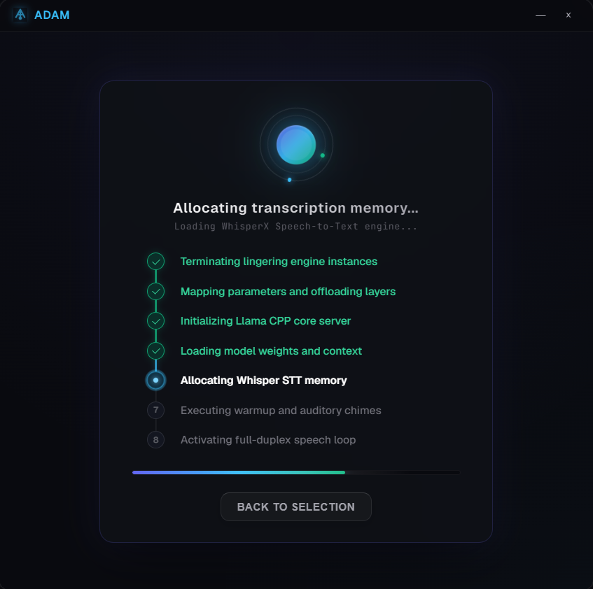

<p align="center">
  
</p>

# Adam: Local AI Desktop Assistant

<p align="center">
  <b>A private, high-performance conversational workspace running entirely on your local hardware.</b>
</p>

<p align="center">
  Adam combines text chat, real-time voice recognition (Speech-to-Text), and natural voice synthesis (Text-to-Speech) with powerful desktop automation capabilities into a single desktop interface.
</p>

---

## Table of Contents

* [Core Features](#core-features)
* [Technical Specifications](#technical-specifications)
* [Installation & Setup Guide](#installation--setup-guide)
* [Building a Standalone Installer](#building-a-standalone-installer)

---

## Core Features

### Conversational Workspace
> High-speed generation with real-time text streaming, voice processing, and web search.

* **Real-time Streaming**
  Answers and tool outputs stream word-by-word instantly to eliminate latency wait times.
* **Integrated Web Search**
  Search the web to answer questions about recent events, with automatic loop prevention.
* **Reasoning Hiding**
  Automatically collapse long reasoning cycles to maintain clean, readable viewports.

<p align="center">
  
</p>

---

### Interactive Action Log
> Inspect system operations executed by the assistant.

* **Tool Timeline**
  Track every tool execution (such as mathematical evaluations, file interactions, or command runs) in a visual timeline.
* **Detailed Inspector**
  Click any action log entry to inspect the exact inputs and outputs returned by the AI.

<p align="center">
  
</p>

---

### Remote Control & Integrations
> Secure desktop automation and notifications from other devices.

* **Remote Control Actions**
  Control your mouse, keyboard, and capture high-resolution screenshots securely from companion devices.
* **Email Alerts**
  Configure automatic email reports sent to your inbox when the application starts or finishes tasks.
* **Mobile Notifications**
  Send real-time updates and notifications to your mobile devices using Pushbullet integration.
* **Local File Explorer**
  Browse, view, and select folders using an interactive folder hierarchy sidebar.

<p align="center">
  
  
  
</p>

---

### Session Context Optimization
> Prune history to control memory usage across separate sessions.

* **Context Compression**
  Prune long message histories manually with a single click to free up VRAM and keep response generation fast.
* **Isolated Sessions**
  Manage multiple independent chat histories concurrently without cross-conversation memory contamination.
* **Auto-Recovery and Timeouts**
  Automatic connection guards prevent large prompts from freezing the UI or interrupting generation streams mid-turn.

---

### Smart Hardware Downloader
> Recommend, download, and configure models automatically.

* **Hardware Optimization**
  Adam automatically scans your system hardware (CPU, RAM, GPU, VRAM) on startup to recommend optimized memory settings for local generation.
* **Segmented Device Toggles**
  Easily switch between CPU and GPU compute modes using a clean, segmented slider interface.
* **Built-in Model Downloader**
  Search, queue, and download GGUF models directly from Hugging Face, featuring download speeds and concurrent progress tracking.
* **Permission-Free Setup**
  Configure and run models instantly without requiring administrator permissions on Windows.

<p align="center">
  
  
</p>

---

## Technical Specifications

### Default Model Pipeline

| Pipeline Stage | Model Name | Hugging Face Repository | File Size | Hardware Support |
| :--- | :--- | :--- | :--- | :--- |
| **Main Brain (LLM)** | `Qwen3.5-4B-Q4_K_M.gguf` | `Qwen/Qwen3.5-4B-Instruct-GGUF` | 2.55 GB | CPU / CUDA GPU |
| **Vision LLM** | `Qwen3VL-2B-Instruct-Q4_K_M.gguf` | `Qwen/Qwen3-VL-2B-Instruct-GGUF` | 1.03 GB | CPU / CUDA GPU |
| **Speed Drafter** | `Qwen3.5-0.8B-Q4_K_M.gguf` | `Qwen/Qwen3.5-0.8B-Instruct-GGUF` | 0.50 GB | CPU / CUDA GPU |
| **Multi-Modal Helper** | `mmproj-Qwen3.5-4B-BF16.gguf` | `Qwen/Qwen3.5-4B-Instruct-GGUF` | 0.63 GB | CPU / CUDA GPU |
| **Speech-to-Text** | `whisperx:medium` | `Systran/faster-whisper-medium` | 1.50 GB | CPU / CUDA GPU |
| **Text-to-Speech** | `tts:qwen` | `Qwen/Qwen3-TTS-12Hz-0.6B-CustomVoice` | 1.20 GB | CPU / CUDA GPU |

### Hardware Requirements

| Component | Minimum Specifications | Recommended Specifications |
| :--- | :--- | :--- |
| **Processor (CPU)** | 4 Cores | 8 Cores (Intel Core i7 / AMD Ryzen 7) |
| **System Memory (RAM)** | 16 GB | 32 GB |
| **Graphics Card (GPU)** | 6 GB VRAM (NVIDIA CUDA-compatible) | 12 GB+ VRAM (NVIDIA RTX Series) |

---

## Installation & Setup Guide

To run this project from the source code, you need to set up both the backend and frontend environments.

### 1. Setup the Python Backend
Open a terminal, navigate to the `backend` folder, create a virtual environment, and install the Python dependencies:
```cmd
cd backend
python -m venv env
call env\Scripts\activate
pip install -r requirements.txt
```

### 2. Setup the Frontend
Open a separate terminal window, navigate to the `electron` folder, and install the Node packages:
```cmd
cd electron
npm install
```

### 3. Run the Application
To start the app, run the development server from the `electron` directory:
```cmd
cd electron
npm run dev
```

---

## Building a Standalone Installer

If you want to package the entire project into a portable Windows executable installer:
```cmd
cd build
build.bat
```
This script builds the Python backend, bundles the required audio libraries, copies settings configurations, and outputs a single, easy-to-run setup file.
